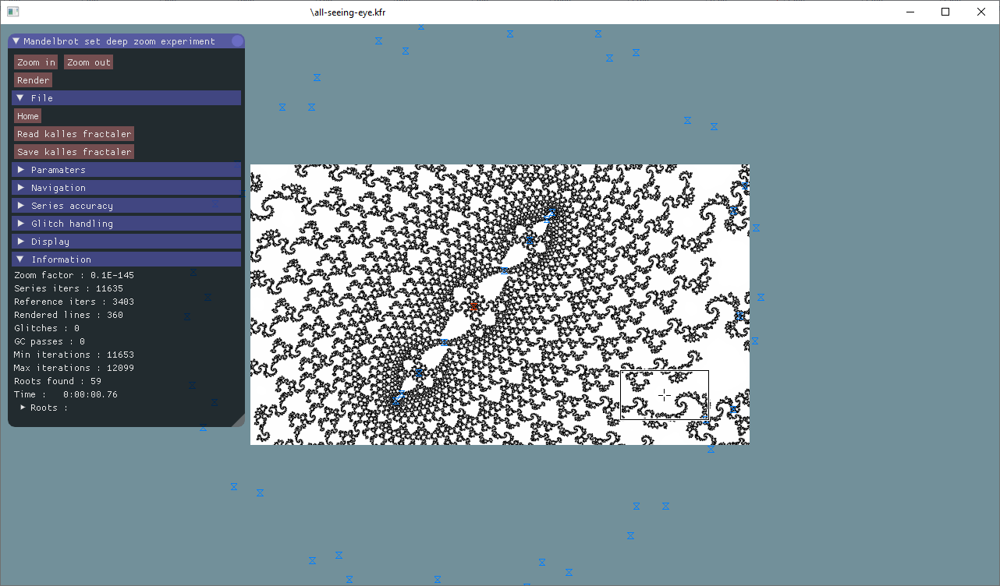

# SuperMB

</img>

 A little mandelbrot set renderer made while experimenting with deep zoom techniques.
 Initial working source code was kindly provided by claude (@fractalforums). Many thanks! :)
 
 *Compilation :*
 I use gcc and Qt-Creator. It is not a complicated project so it could be compiled manually on the command line.
 
 *Some awesome 3rd party libraries included in source are :*
 - tiny file dialogs : https://github.com/Sejoslaw/TinyFileDialogs 
 - ImGUI : https://github.com/ocornut/imgui
 - mpReal
